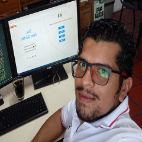

# 

 

  <h3>👋🏾 Hola, soy...</h3>
  

    Mi nombre es <b>Davis Quintero</b> soy:
  

  

    <b>💾 Técnico en Sistemas</b> con en enfasis en Mantenimiento Preventivo y Correctivo a Equipos de Computo.
  

  

    <b>🚀Arquitecto Frotend</b> (HTML, CSS y JavaScript).
  

  

    <b>📈 Trading Apacionado</b>...
  

 

---

\
Con un alto nivel en el desarrollo de actividades productivas relacionadas con el ensamblaje, mantenimiento, actualización, instalación y configuración de equipos de cómputo; manejo de Software Ofimático y Herramientas Tics.

Desde el 2014 tengo experiencia en el Desarrollo Web como Freelance, orientado a la Arquitectura Frontend; maquetación y optimización para el buen posicionamiento y rendimiento de sitios Web e Interfaces de Usuario.

Las tecnologias que manejo son:

  
  
  
  
  
  

---

Visita mis redes sociales:

- <a href="https://www.linkedin.com/in/davisquintero/" target="_blank" class=""> _**Linkedin**_ </a>
- <a href="https://github.com/davkode" target="_blank" class=""> _**GitHub**_ </a>
- <a href="https://www.instagram.com/davkintero1/" class=""> _**Instagran**_ </a>
